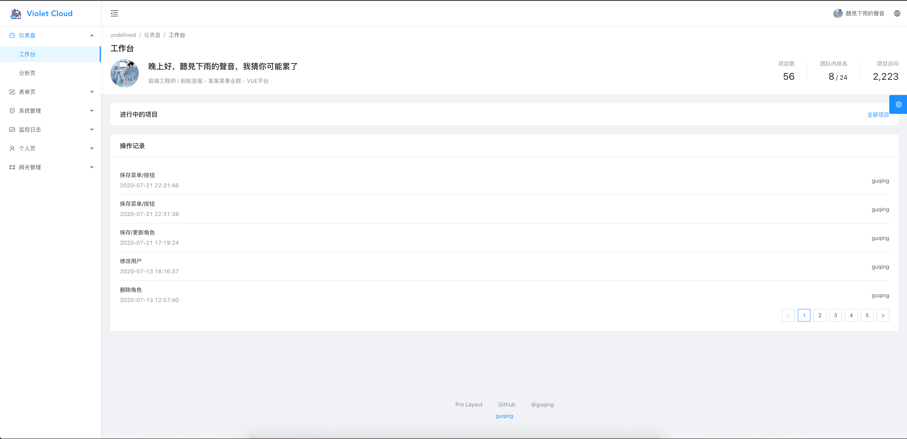
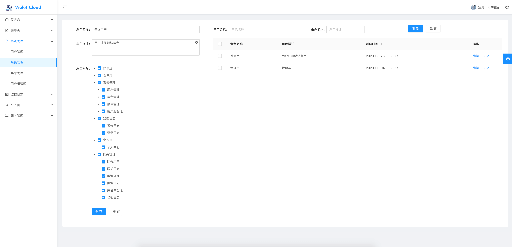
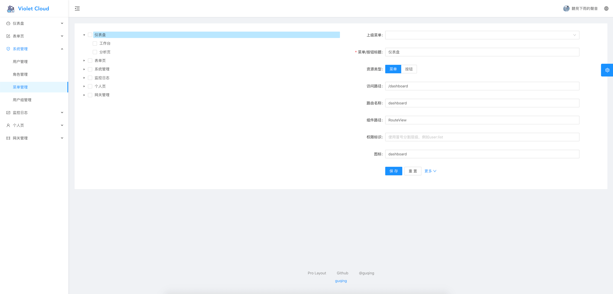
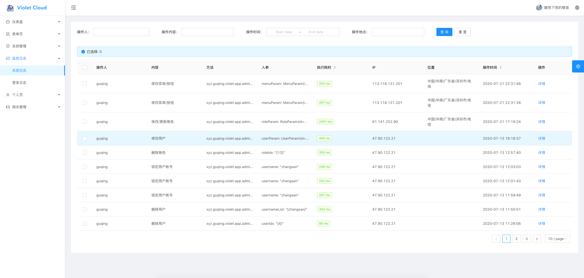
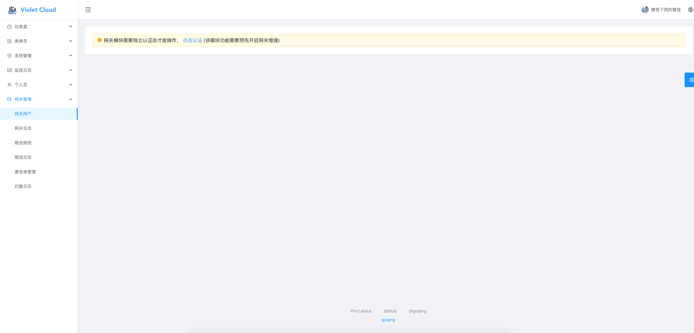
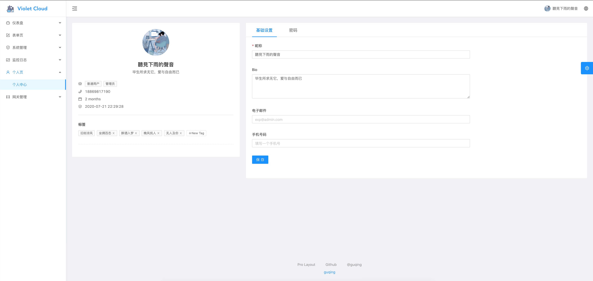

<h1 align="center">Violet Cloud</h1>
<div align="center">
一个基于spring cloud的微服务后台管理系统，可方便的接入自己的微服务
</div>

<div align="center">

<a href="https://gitpod.io/#https://github.com/guqing/violet-cloud"></a>


</div>

### 前端项目地址
> https://github.com/guqing/violet-cloud-web

### 预览图








### 技术选型
| 技术                 | 版本           | 说明                                                         | 官网                                            |
| -------------------- | -------------- | ------------------------------------------------------------ | ----------------------------------------------- |
| Spring boot          | 2.2.6.RELEASE  | 容器+MVC框架                                                 | https://spring.io/projects/spring-boot          |
| Spring cloud         | Hoxton.RELEASE | 微服务框架                                                   | https://spring.io/projects/spring-cloud         |
| Spring Cloud Alibaba | 2.1.1.RELEASE  | 微服务框架                                                   | https://spring.io/projects/spring-cloud-alibaba |
| Mybatis plus         | 3.3.1.tmp      | 是一个 [MyBatis](http://www.mybatis.org/mybatis-3/) 的增强工具 | https://mybatis.plus/                           |
| Mysql                | 8.0.20         | 关系行数据库                                                 | https://www.mysql.com/                          |
| JustAuth             | 1.1.0          | 第三方登录开源组件                                           | https://github.com/justauth/JustAuth            |
| Spring Data MongoDB  | 2.2.6.RELEASE  | MongoDB基于Spring的编程模型                                  | https://spring.io/projects/spring-data-mongodb  |
| Lombok               | 1.18.12        | 简化对象封装工具                                             | https://github.com/rzwitserloot/lombok   

### 项目结构
```
violet-cloud
├─document                        ------ 文档和数据库文件
├─scripts                         ------ 脚本
├─violet-app                      ------ 微服务模块
│  ├─violet-app-admin             ------ 微服务子系统系统核心模块
│  ├─other...           		  ------ 可接入其他微服务
├─violet-auth                     ------ 认证服务器
├─violet-common                   ------ 通用模块
│  ├─violet-common-core           ------ 系统核心依赖包
│  ├─violet-common-support        ------ 非响应式servlet系统核心依赖
│  ├─violet-common-datasource-starter     ------ 系统数据库自动装配starter
│  ├─violet-common-redis-starter          ------ 系统Redis自动装配starter
│  └─violet-common-security-starter       ------ 微服务子系统安全配置自动装配starter
├─violet-gateway                  ------ 微服务网关
```
