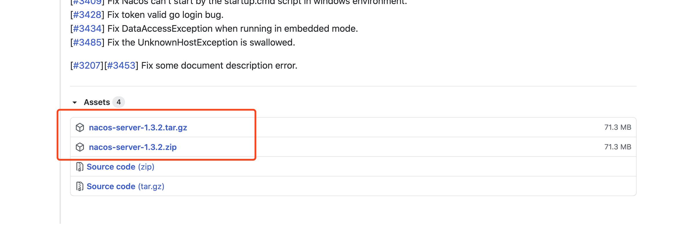
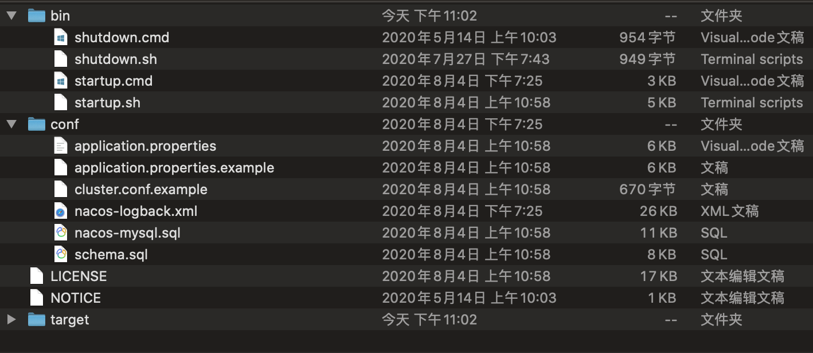
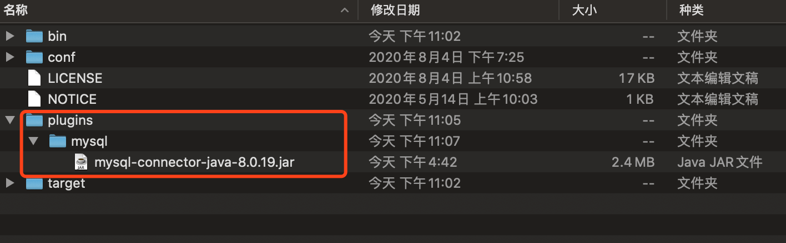
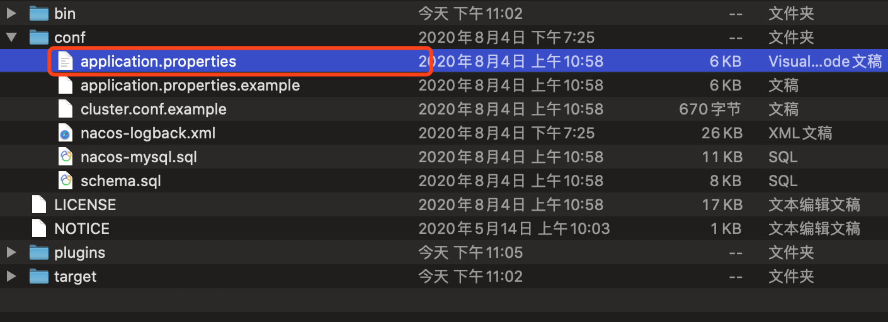
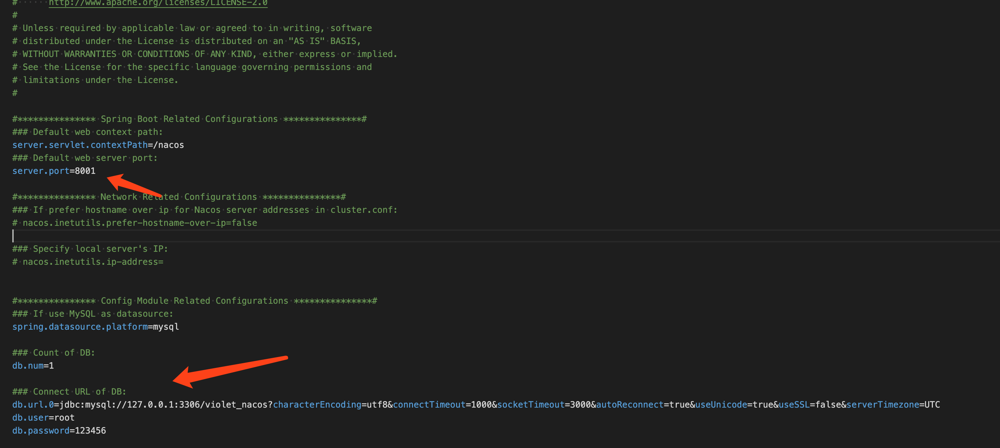
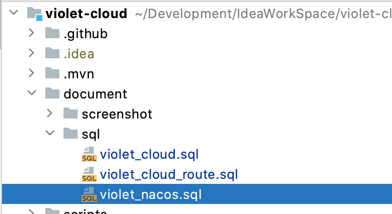
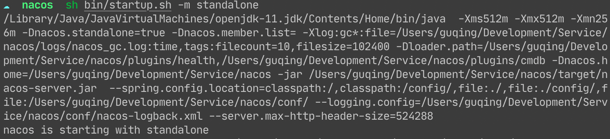
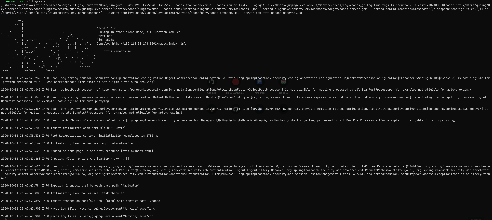
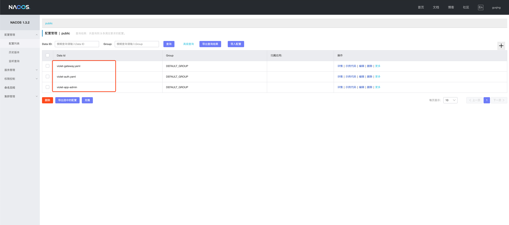
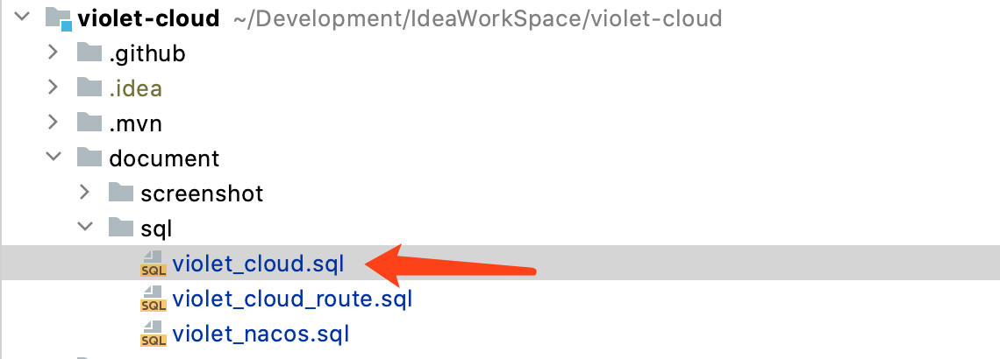

# 开发教程

## 导入项目

### 环境准备

待补充

### 后端项目

#### 配置`Nacos`

通过github可以下载到`nacos`点击👉[下载地址](https://github.com/alibaba/nacos/releases)👈选择版本即可看到如下内容，版本可以选择最新版



两个文件随意二选一下载即可。

下载好以后解压得到如下目录：



由于`nacos`不支持`mysql8`版本需要自备驱动，所以对于使用`mysql8`及其以上版本的用户需要进行如下操作：

新建一个`plugins`目录并创建在目录`mysql`，然后复制一个`mysql`的驱动放到该目录下名字随意但不要有中文，最后结果如下：



这样在nacos启动时就会自动寻找到该`mysql`驱动啦。

然后还需要配置`nacos`连接到`mysql`数据库，需要修改`conf`目录下的`application.yaml`文件



按自己的`mysql`数据库信息进行如下配置:

端口号改为`8001`

数据库名称改为`violet_nacos`



然后到数据库执行项目中的`violet_nacos.sql`脚本



操作完以上步骤就可以启动`nacos`了,windows用户点击`bin/startup.cmd`, Mac及Linux执行如下命令：

```shell
sh bin/startup.sh -m standalone
```



可以查看`logs/start.out`启动日志确认是否启动成功。



打开浏览器访问:

```
http://localhost:8001/nacos
```

即可看到登陆页面，登陆账号如下:

```
用户名：violet
密码: 123456
```

登陆成功后就可以看到项目配置列表了，根据需要将这三个配置文件中`127.0.0.1`修改为自己对应的`ip`地址



#### 导入基础数据

到数据库管理软件中执行如下脚本，即可完成数据库创建和基础数据导入



系统账号

```
用户名: guqing
密码: 123456
```

#### 运行项目

待补充

### 前端项目

补充中

