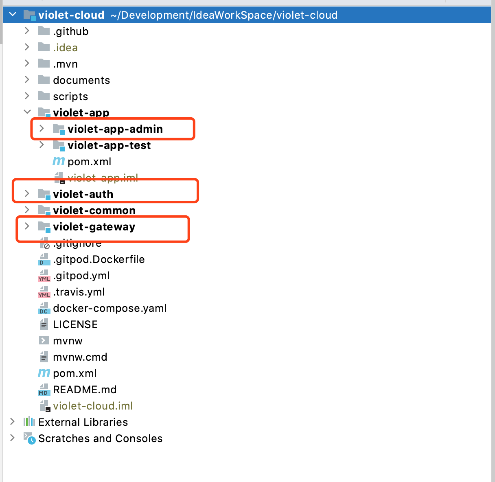
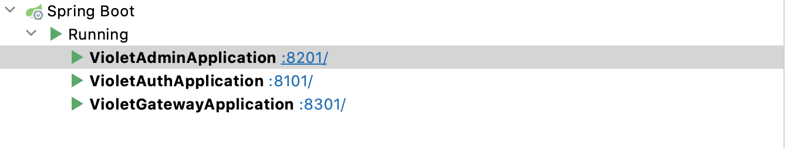
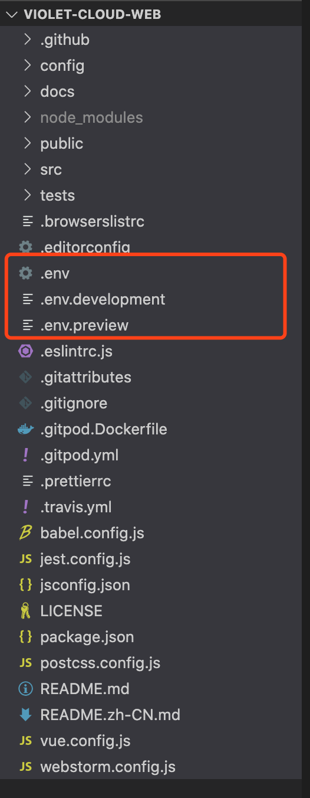
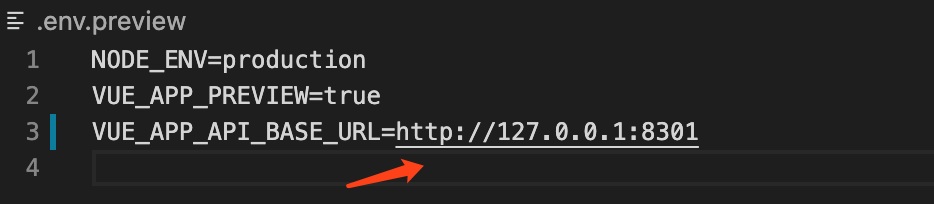
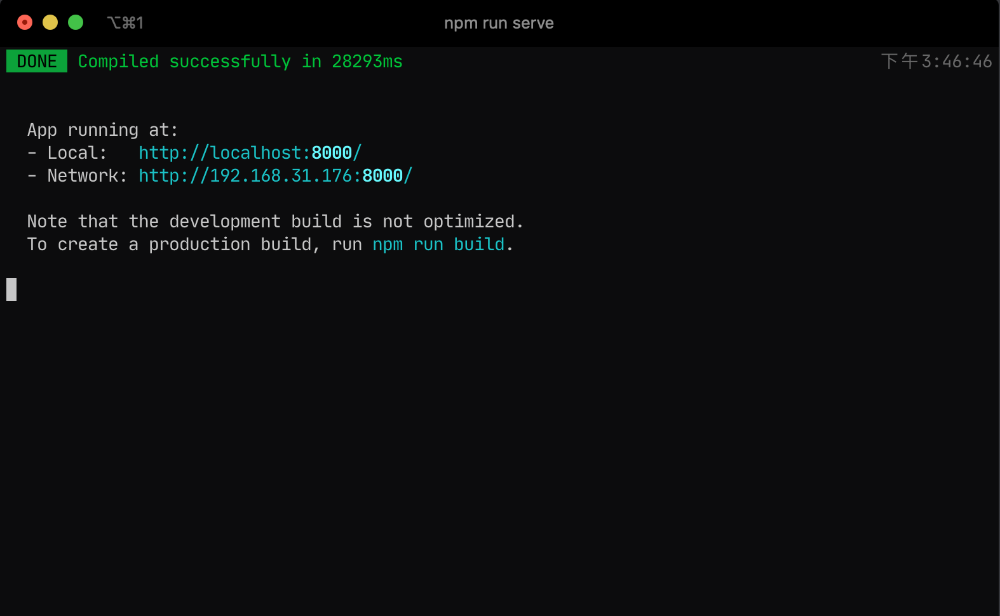
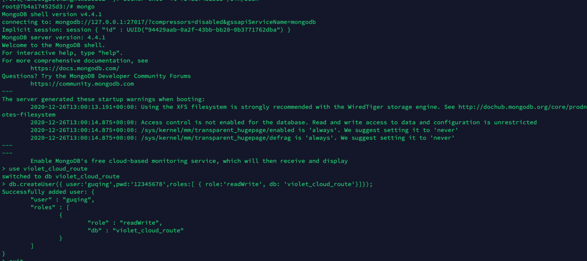
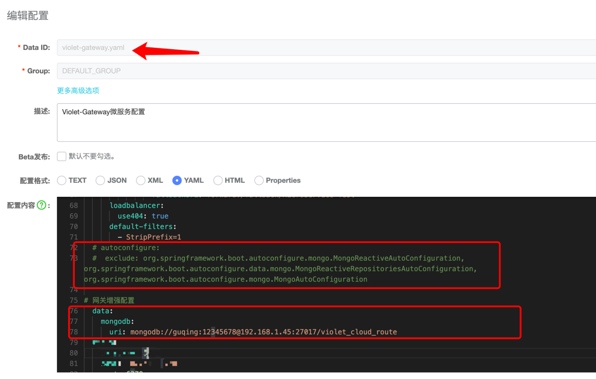

# 开发教程

## 导入项目

### 环境准备

1. IDE：[IntelliJ IDEA](https://www.jetbrains.com/idea/download/) 或者 [STS](https://spring.io/tools)（Spring Tools Suite）
2. 请使用`JDK8`及以上版本
3. 构建工具使用 Maven

4. 本项目使用了`Lombok`，所以请确保IDEA安装了Lombok插件

> 如果使用的 `IDE` 是 `IntelliJ IDEA`，请在设置中启用 `Build, Execution, Deployment/Annotation Processors` 的 `Enable annotation processing`

5. 安装Redis，可以使用`docker`安装
```shell
docker run --name redis -p 6379:6379 -d redis redis-server
```
更多内容参考: [Docker Hub Redis](https://hub.docker.com/_/redis)
6. 安装Mysql，本项目使用的mysql驱动版本是`8.0.19`, 所以可以默认安装mysql最新版，如果是低版本没有测试过不知道是否支持
7. 对于前端项目还需要`Nodejs`环境，编辑器推荐`Vscode`

### 后端项目

#### 克隆项目到本地

```
git clone https://github.com/guqing/violet-cloud.git
```

#### 配置`Nacos`

通过github可以下载到`nacos`点击👉[下载地址](https://github.com/alibaba/nacos/releases)👈选择版本即可看到如下内容，版本可以选择最新版


两个文件随意二选一下载即可。

下载好以后解压得到如下目录：


由于`nacos`不支持`mysql8`版本需要自备驱动，所以对于使用`mysql8`及其以上版本的用户需要进行如下操作：

新建一个`plugins`目录并创建在目录`mysql`，然后复制一个`mysql`的驱动放到该目录下名字随意但不要有中文，最后结果如下：


这样在nacos启动时就会自动寻找到该`mysql`驱动啦。

然后还需要配置`nacos`连接到`mysql`数据库，需要修改`conf`目录下的`application.yaml`文件


按自己的`mysql`数据库信息进行如下配置:

端口号改为`8001`

数据库名称改为`violet_nacos`


然后到数据库执行项目中的`violet_nacos.sql`脚本


操作完以上步骤就可以启动`nacos`了,windows用户点击`bin/startup.cmd`, Mac及Linux执行如下命令：

```shell
sh bin/startup.sh -m standalone
```


可以查看`logs/start.out`启动日志确认是否启动成功。


打开浏览器访问:

```
http://localhost:8001/nacos
```

即可看到登陆页面，登陆账号如下:

```
用户名：violet
密码: 123456
```

登陆成功后就可以看到项目配置列表了，根据需要将这三个配置文件中`127.0.0.1`修改为自己对应的`ip`地址


#### 导入基础数据

到数据库管理软件中执行如下脚本，即可完成数据库创建和基础数据导入


系统账号

```
用户名: guqing
密码: 123456
```

#### 运行项目

使用IDEA打开项目，分别启动这三个模块

```
项目后台接口：violet-app-admin
认证中心： violet-auth
服务网关: violet-gateway
```



启动时检查启动日志是否有报错，根据错误日志检查相应配置



### 前端项目

#### 克隆项目

```shell
git clone https://github.com/guqing/violet-cloud-web.git
```

#### 检查api路径

由于我使用`travsi ci`自动部署预览项目到服务器所以`api`地址，如果是本地启动需要修改如下文件



中的`VUE_APP_API_BASE_URL`为网关模块`violet-gateway`的地址本地启动则是`http://127.0.0.1:8301`



#### 安装依赖

切换到项目文件夹

使用`yarn`安装或`npm`安装都可以，前提是安装了`Nodejs`

使用**yarn**方式

```shell
# 安装
yarn install
# 启动
yarn run serve
```

或者使用**npm**方式

```shell
# 安装
npm install
# 启动
npm run serve
```

启动成功即可看到



## 进阶
### 网关使用说明
网关管理模块包括:网关用户、网关日志、限流规则、黑名单管理和拦截日志,如果要使用这些功能需要开启网关增强。
#### 安装mongodb数据库
对于Linux或Mac用户可以使用docker安装方式，执行以下步骤时请确保你已安装`docker`
```shell
docker run --name mongo -p 27017:27017 -v $PWD/db:/data/db -d mongo
```
查看容器
```shell
docker ps
# 结果如下示例
CONTAINER ID        IMAGE               COMMAND                  CREATED             STATUS              PORTS                               NAMES
7b4a174525d3        mongo               "docker-entrypoint..."   24 minutes ago      Up 24 minutes       0.0.0.0:27017->27017/tcp            mongo
```
复制`CONTAINER ID`（容器id）执行如下命令
```shell
docker exec -it 容器id /bin/bash
```
再依次执行以下命令
```shell
mongo

use violet_cloud_route

db.createUser({ user:'guqing',pwd:'12345678',roles:[ { role:'readWrite', db: 'violet_cloud_route'}]});
```
结果如下图所示



执行完后别着急退出，继续执行如下图脚本里的内容


#### 配置网关增强
在`nacos`控制台修改`violet-gateway.yaml`如下图所示，注释`MongoAutoConfiguration`并配置mongodb连接就完成啦
```yaml
autoconfigure:
  exclude: org.springframework.boot.autoconfigure.mongo.MongoReactiveAutoConfiguration,org.springframework.boot.autoconfigure.data.mongo.MongoReactiveRepositoriesAutoConfiguration,org.springframework.boot.autoconfigure.mongo.MongoAutoConfiguration
```

